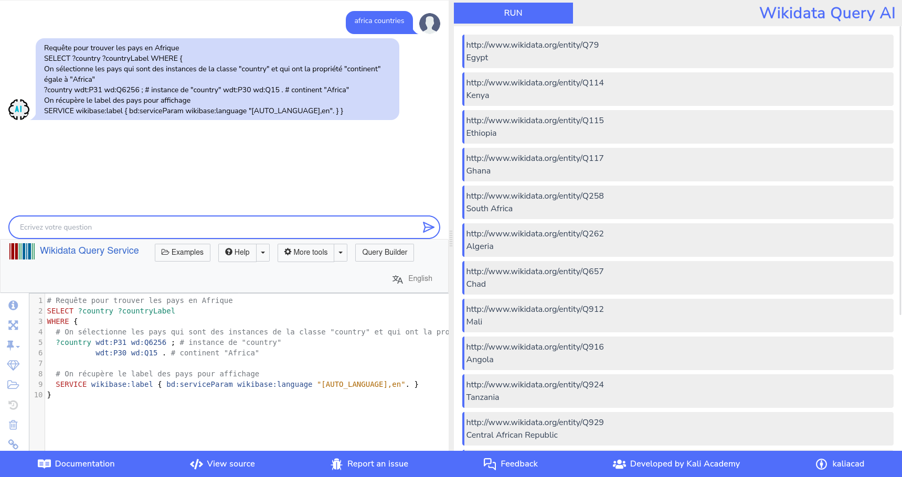

# Wikidata Query with AI

[](https://github.com/Naereen/badges/)
[](https://lbesson.mit-license.org/)
[](https://GitHub.com/kaliacad/wikidataqueriIA/graphs/commit-activity)
[](https://GitHub.com/kaliacad/wikidataqueriIA/graphs/contributors/)
[](https://github.com/kaliacad/wikidataqueriIA/)
[](https://GitHub.com/kaliacad/wikidataqueriIA/network/)
[](https://GitHub.com/kaliacad/wikidataqueriIA/issues/)
[](https://GitHub.com/kaliacad/wikidataqueriIA/commit/)
[](https://GitHub.com/kaliacad/wikidataqueriIA/pull/)
[](http://makeapullrequest.com)
[](https://github.com/Naereen/kaliacad/wikidataqueriIA/tags/)
[](https://github.com/kaliacad/wikidataqueriIA/releases)

### WikidataQuery + Resultat



### WikidataQuery + While fetching data


This project enables users to write and execute SPARQL queries on Wikidata directly within an Express.js application, without needing to visit the Wikidata website.

## Features

- Execute SPARQL queries
- Retrieve and display query results in a user-friendly interface
- Built with React and Vite for a modern front-end experience

## Prerequisites

- Node.js and npm installed
- Basic understanding of SPARQL and Wikidata

## Installation

1. Clone the repository:

   ```sh
   git clone https://github.com/kaliacad/wikidataqueriIA.git
   cd wikidataqueriIA
   ```

2. Install dependencies:
   ```sh
   npm install
   ```

## Usage

1. Start the development server:

   ```sh
   npm run dev
   ```

2. Open your browser and navigate to `http://localhost:5173`.

## Folder Structure

- `public/` - Static assets
- `src/` - Source code for the React front-end
- `index.html` - Main HTML file
- `package.json` - Project metadata and dependencies
- `vite.config.js` - Vite configuration

## Contributing

Contributions are welcome! Please open an issue or submit a pull request.

## License

This project is licensed under the MIT License.

#

👉 **Explore and Interact**:

Have fun with the project!

## ⚠ Disclaimer

We are deeply committed to fostering genuine open-source contributions. Consequently, we maintain a strict policy against the use of plagiarized source code. Any Pull Requests (PRs) that do not adhere to our Terms and Conditions will be identified as spam and subsequently closed by our maintainers.

Please be aware that we do not accept responsibility for any potential damages resulting from the scripts or programs included in this repository. These projects are publicly curated and do not undergo stringent malware or virus checks. Therefore, neither the maintainers nor the owner of this repository can be held accountable for any issues arising from running any of the programs or applications found within this repository.

##### <p align="center">Hurray! Now you are a part of the open-source community 🚀🚀🚀</p>


## Contributors

<a href="https://github.com/kaliacad/wikidataqueriIA/graphs/contributors">
  
</a>
